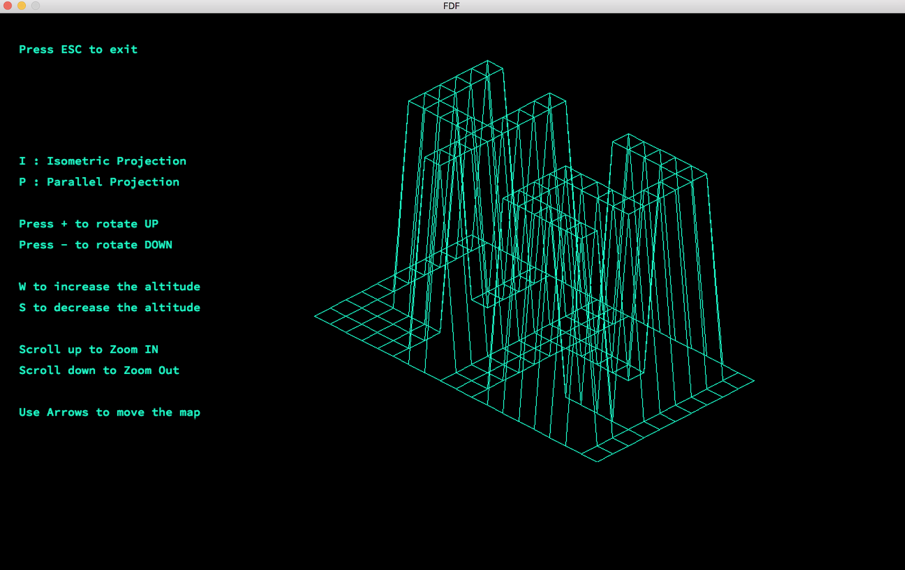

# FDF Project "Wire Frame"

* FDF is a simple 3D maps viewer.
* Currently works only on mac OS

* In this project i used some functions from my library "libft".
* For more informations you can find the project subject FDF.pdf .
